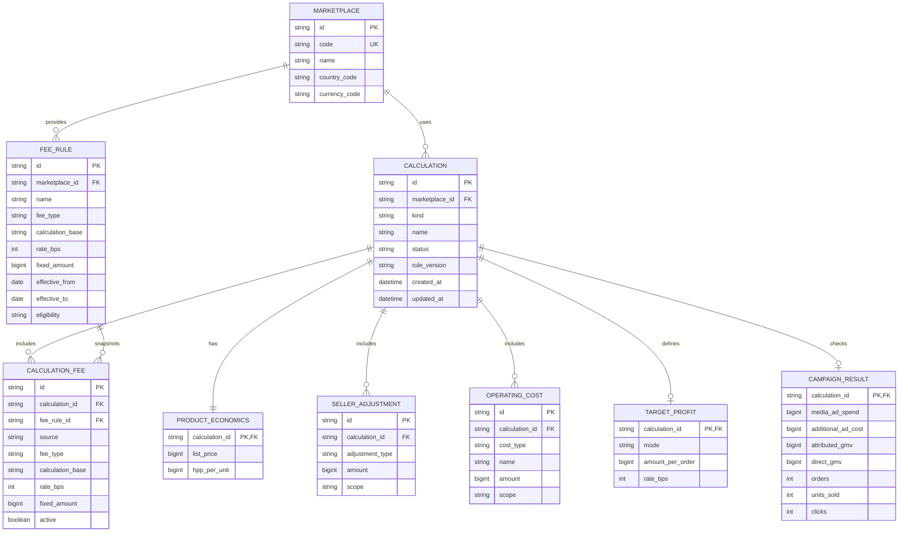

# GOProfit — ERD

Dokumen ini memisahkan model domain dari penyimpanan. MVP saat ini belum
memakai database; halaman Saved menyimpan snapshot `SavedCalculation` di
localStorage. Diagram berikut adalah model konseptual yang bisa dipakai saat
storage persisten ditambahkan.

## Mapping ke code sekarang

- `Marketplace` → `PlanAdsInput.marketplace` dan `SHOPEE_MARKETPLACE`.
- `ProductEconomics` → `listPrice` dan `hppPerUnit`.
- `SellerAdjustment` → `SellerAdjustment[]`.
- `CalculationFee` → `ScenarioFee[]`.
- `OperatingCost` → `ScenarioCost[]`.
- `TargetProfit` → union `TargetProfit`.
- `CampaignResult` → `CampaignInput` di dalam `CheckAdsInput`.
- `Calculation` snapshot → `SavedCalculation` di repository browser.

`PlanAdsResult` dan `CheckAdsResult` tidak perlu menjadi tabel sumber pada
MVP. Keduanya adalah hasil deterministik yang bisa dihitung ulang dari input
dan `calculationRuleVersion`, tetapi boleh disimpan sebagai snapshot untuk
riwayat dan audit ringan.
